[Click here for live site](https://sugra-d21ca322fc38.herokuapp.com)

Source: [amiresponsive](https://ui.dev/amiresponsive?url=https://sugra-d21ca322fc38.herokuapp.com)

 Sugra Games is an online videogame marketplace where game developers can sell their video games directly to customers. The website has been designed to provide unique functionality and UI/UX features to game developers and gamers; upon signing up to the website, users choose whether they're buying and selling games, and are given access to unique features based on their  profile usertype. Developers can submit games to be included on the website's store; games must first be authenticated by the site administrator before being published and made available on the public marketplace. Gamers can buy games, and then leave reviews and comments and games which they've purchased. Gamers also can view their download library, wishlist and previous orders. 
 
 Furthermore, users can sign up very easily through their gmail accounts - this makes the sign up process very streamlined, thereby providing value to users and getting them registered on the website as quick as possible. 
 
 The name is derived from the Irish word *súgradh*, which relates to the concept of play. The logo is a simple representation of a video game controller, using a bright and playful colour palette that sets the visual aesthetic of the entire site. 

## UX

The primary goal of this project, from a User Experience (UX) perspective, was to deliver two distinct yet visually cohesive user interfaces - one designed specifically for developers, and the other tailored for gamers. These two interfaces, though catering to related but separate audiences, were intended to work in harmony, drawing from the same underlying database and complementing each other seamlessly.

The app's design prioritizes simplicity and intuitiveness, ensuring a smooth and responsive user interaction. Key user actions are reinforced through the use of strategically placed pop-up messages, providing immediate feedback and confirmation to the users. This approach aims to create a sense of clarity and control, guiding users through the app's functionality in a natural and intuitive manner.

The unified aesthetic across the developer and gamer interfaces serves to reinforce the app's brand identity and create a cohesive user experience, even as the specific functionality and features cater to the distinct needs of each target audience. This design approach not only enhances the overall user satisfaction but also fosters a sense of familiarity and trust. 

By carefully balancing the unique requirements of developers and gamers while maintaining a visually harmonious and responsive user experience, this project aims to deliver a compelling and engaging application that meets the diverse needs of its users.

### Colour Scheme

This color palette comprises a mix of bold, vibrant colors like auburn and green, creating an eye-catching and dynamic aesthetic that grabs users' attention, all while visually referencing the bright, "plastic" aesthetic of old video game consoles such as the SNES, Mega Drive and Gameboy. The inclusion of softer tones like the champagne pink and white smoke offers balance, preventing the design from feeling overly intense or fatiguing for users browsing the site for extended periods. These calmer hues are effectively used for layout elements, typography, and backgrounds, ensuring a pleasant and comfortable viewing experience.

Furthermore, the overall harmony of the palette creates a cohesive brand identity that is applied consistently across the website, from the landing pages to individual product listings. This coherence helps reinforce the professionalism and trustworthiness of the marketplace, crucial factors for convincing users to engage with and purchase from the platform. 
The versatility of the color choices also allows for easy implementation across different user interface components, from navigation menus to call-to-action buttons.

By leveraging this thoughtfully curated color palette, the website can establish a visually striking and user-friendly design, ultimately enhancing the overall experience for both casual browsers, dedicated gamers, and professional game developers looking to sell their creations. 

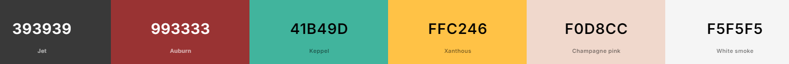
Source: [coolors.co](https://www.coolors.co)

### Typography

Four different fonts are used across the website. 

[Oxanium](https://fonts.google.com/specimen/Oxanium) is used for the logo banner and headings. it has a subtly futuristic, technological style that coheres with the video game theme of the site. 

[Roboto](https://fonts.google.com/specimen/Roboto) is used for sub-headings. It is a neutral, sans-serif font that is accessible in terms of reading legibility. 

[Noto Sans](https://fonts.google.com/noto/specimen/Noto+Sans) is used for the primary informational text throughout the site. Like Roboto, it is a readable sans serif font.  

[Press Start 2P](https://fonts.google.com/specimen/Press+Start+2P) is used for call-to-action buttons. This font is more explicitly linked to video game aesthetics, and is used throughout the website to highlight areas of user interactivity; this reinforces the website's link to video games.  

Social media brand icons from [Font Awesome](https://fontawesome.com) are used in the footer.

## Business Model

- **Type**: Business-to-Consumer relationship with customers (B2C) and Business-to-Business relationship with developers (B2B)
- **Offerings**: Sugra is a marketplace dedicated to providing a wide range of video games. 
- **Audience**: The audience is twofold:
  - Gamers of all ages, from casual to hardcore players, with a focus on providing a user-friendly shopping experience.
  - Developers who want to sell their games
- **Sales Process**: Sugra offers one-off payment for customers to download games.
- **Key Objectives**: Build a strong, trusted brand in the gaming industry through high-quality offerings, reliable customer service, and a seamless online shopping experience.

### Growth Strategy
- **Local to Global**: Initially focus on domestic growth by partnering with local game developers, then gradually expand to international markets.
- **Customer Feedback**: Use initial customer feedback to refine product offerings and prioritize popular game genres.

## SEO & Marketing Strategy

### SEO Strategy
1. **Keyword Research**
   - Conduct comprehensive keyword research using tools like SEMrush and Google Trends to identify short-tail keywords (e.g., "video games marketplace," "buy video games online") and long-tail keywords (e.g., "best place to buy indie games online," "exclusive video game deals").

2. **On-Page SEO**
   - Optimize meta tags, titles, descriptions, and URLs with relevant keywords.
   - Use descriptive file names and alt text for images to increase search relevance.

   Implementation examples:
   - Meta description and keywords implemented in base.html for site-wide SEO
   - Keywords focused on indie gaming marketplace and developer-centric terms
   - Alt text used consistently for game thumbnails and screenshots
   - Descriptive URLs using game titles and developer names
   - Structured data for game pricing, ratings, and reviews
   - Mobile-responsive design for better search engine rankings

3. **Technical SEO**
   - Implement a clean sitemap and `robots.txt` file to facilitate proper indexing by search engines.
   - Optimize for speed by compressing images and using pagination to ensure a fast, responsive user experience.
   
   Implementation examples:
   - Pagination implemented for game listings and reviews
   - Image optimization through Cloudinary
   - Responsive image loading using Bootstrap classes
   - Clean URL structure throughout the application
   - Fast loading times through efficient database queries

### Marketing Strategy

For this project, I created a simple wireframe of a Facebook Business Page, as seen below. 

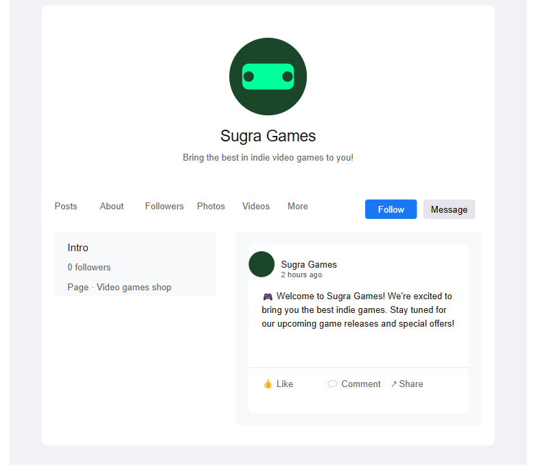

I have also added a MailChimp link in the footer. This is a means of encouraging users to sign up for the Sugra Newsletter, which would provide a direct means of communication between the product owner and the two target audiences. 

Below I set out future steps that would be taken to market the website and company more broadly:

1. **Social Media Marketing**
   - Establish and maintain active pages on Instagram, Facebook, and Twitter to share game updates, community engagement posts, and exclusive deals.
   - Feature user-generated content and testimonials to build trust and community presence.
   - Use targeted advertising, including in-game ads on popular platforms, to reach a gaming-focused audience.

2. **Email Marketing**
   - Build a newsletter to share updates, new game releases, and special promotions. Offer incentives like exclusive discounts to encourage sign-ups.
   - Use Mailchimp to segment email lists and send tailored promotions based on user preferences and past purchases.

3. **Influencer Marketing**
   - Partner with popular gaming influencers and streamers to promote Sugra on platforms like Twitch and YouTube.
   - Offer affiliate links or discount codes to encourage influencers' audiences to make purchases.

4. **Community Engagement**
   - Sponsor or participate in local gaming events and conventions to foster brand awareness and build relationships with potential customers.
   - Consider sponsoring eSports tournaments or collaborating with popular game developers for exclusive content on the Sugra platform.

5. **Paid Advertising**
   - Utilize Google Ads and Facebook Ads to reach potential customers by targeting relevant keywords and demographics.
   - Employ retargeting ads to reach users who visited Sugra but haven’t yet made a purchase, increasing conversion opportunities.

The success of the above strategies would be ascertained through monitoring and assessing of the following performance metrics. 

- **SEO Success**: Track organic search traffic, keyword ranking improvements, and click-through rates.
- **Social Media Engagement**: Monitor engagement rates, follower growth, and conversions from social media channels.
- **Email Campaign Performance**: Track open rates, click-through rates, and conversions from email marketing efforts.
- **Sales and Revenue Growth**: Measure revenue growth, average order value, and customer acquisition costs to determine the effectiveness of marketing strategies.

By implementing these SEO and marketing strategies, Sugra could establish a strong, recognizable presence in the video game marketplace sector, effectively reaching its target audience and driving sustained growth.

## User Stories

User stories formed a key part of the Agile methodology which guided the development of this application. They can be found within the Product Backlog on my Github Milestone page
[here](https://github.com/cthlbrennan/sugra/milestone/1).

### Users

- As a new user, I want to have a clear idea of the purpose of the web application so that I can understand the value that it would provide me.
- As a user, I want to be able to log in through my gmail or social media account. 
- As a user, I want to be able to log out easily so that I can be sure that my data remains secure after I have finished using the website. 
- As a user, I want to be able to log in with a username and password so that I can securely access my data.
- As a user, I want to be able to reset my password so that I can regain access to my database in case I forget the original.

### Customers

- As a customer, I want to be able to leave reviews on products I have purchased so that I can provide feedback for the developer and/or other customers
- As a customer, I want to read reviews and ratings from other players before making a purchase.
- As a customer, I want to add games to my wishlist so I can keep track of titles I'm interested in.
- As a customer, I want to easily download my purchased games to my device.
- As a customer, I want to have access to a library of games I've bought where I can redownload previously bought games.
- As a customer, I want to easily purchase games from the marketplace. 

### Developers

- As a developer, I want to know how many copies of my game have been sold.
- As a developer, I want to have a public profile where I can showcase all my games to customers in one place.
- As a developer, I want to have a public profile where I can showcase all my games to customers in one place.
- As a developer, I want to add screenshots to my game's store page so that customers can get a feel for it.
- As a developer, I want to add games to the website's public marketplace so that I can make money.

### Product Owner

- As the product owner, I want to facilitate two types of user - customers and developers - so that I can provide them with different services and functionality.
- As the product owner, I want to provide users with an intuitive UI so that they can easily navigate the site and benefit from an excellent UX.
- As the product owner, I want to make sure that there are custom 404 and 500 pages which match the aesthetic of the website to provide users with a positive UX. 
- As the product owner, I want to make sure that the website's code is clean and maintainable so that the services provided to users is professional.
- As the product owner, if a user submits a message then I want them to receive a confirmation email telling them that their message has been submitted to improve the user experience. 
- As the product owner, I want users to get messages after they've logged in, logged out, made a purchase, etc so that they get immediate feedback on their interactions. 
- As the product owner, I want to ensure that my deployed website is linked to a cloud-based database.
- As the product owner, I want there to be an admin account so that the website can be monitored and maintained.
- As the product owner, I want to have the website deployed so that people can find and use my product.
- As the product owner, I want to ensure that the database models are robust and respond appropriately to the needs of my users.

### Site Administrator

- As the site administrator, I want users to be able to send messages to me in case they have any queries, feedback, etc.
- As the site administrator, I want to have CRUD functionality over all users' databases so that I can monitor and maintain the website. 
- As the site administrator, I want to approve or reject new game submissions to ensure quality content.
- As the administrator, I want to be able to securely access the admin page so that I can maintain and update the website easily.

## Wireframes

To follow best practice, wireframes were developed for mobile, tablet, and desktop sizes.

I've used [Balsamiq](https://balsamiq.com/wireframes) to design my site wireframes.

Home
  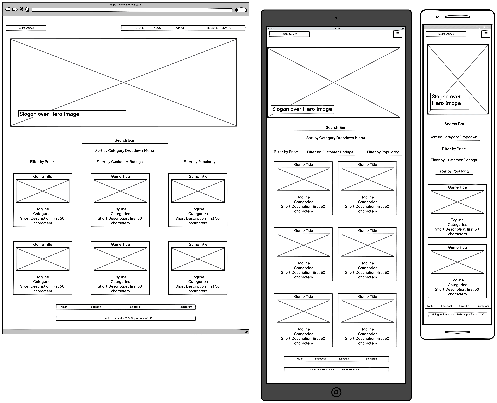

Customer Dashboard
  

Developer Dashboard
  

Publish Game Page
  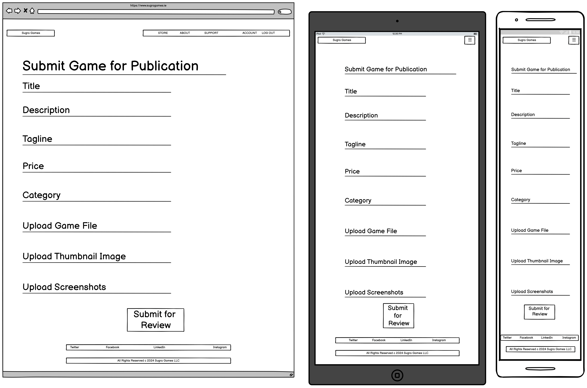

Contact Page
  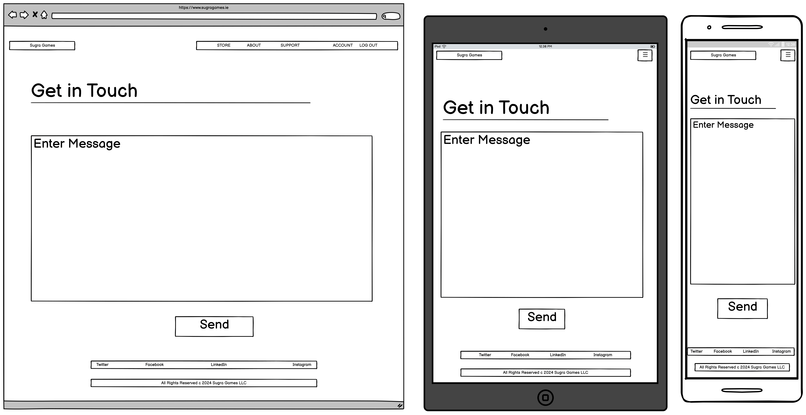

Game Store Page
  

## Features

### Existing Features

#### Logo

Upon entering the page, the logo is apparent in the top left corner. This tells the user what website they are on. It is also clickable, allowing users to navigate easily and directly back to the home page from any other page.

#### Navigation Bar

Upon entering the page, it is immediately apparent to the user that there is a menu that provides them links to the pages of the website. This makes the page easily navigable for the user. 

#### Dropdown Menu

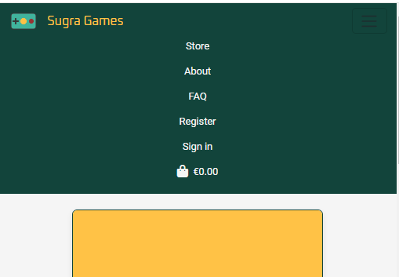

At mobile and tablet screen width, the menu options are accessed through a dropdown menu via a hamburger icon.

#### Hero Image Carousel on Index Page

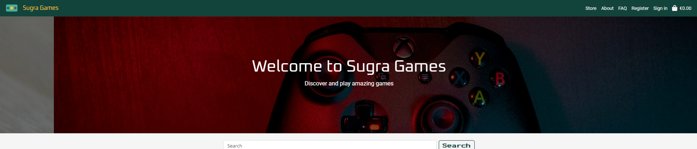

The index page features a carousel of hero images. This is a good way to establish the theme of the website and provide a good user experience. 

#### About Section

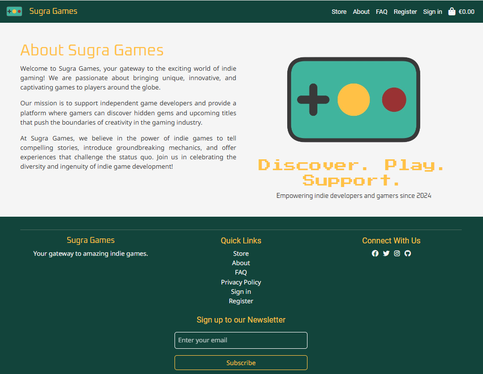

The About page provides more information to users on the services and value of the website. It features a large image of the logo. 

#### Store

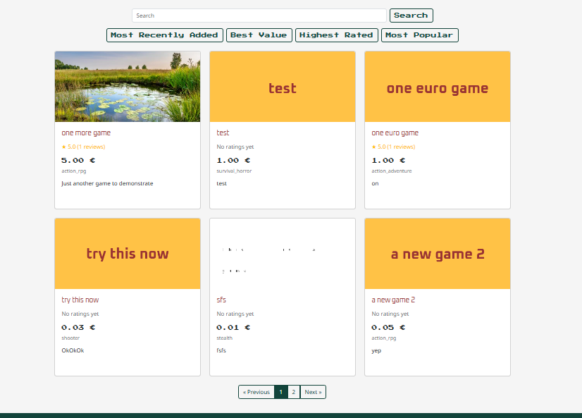

The Store page features a grid of game cards. This is a good way to display the games to the user. It also features a search bar, as well as filter buttons that rank the games by popularity, rating, value and most recently added. 

#### Footer 

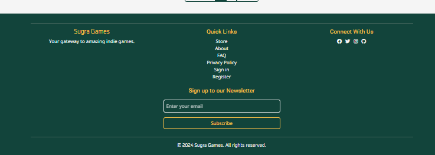

The footer is present on every page. It contains social media links, as well as links to other pages on the website; these links change depending on whether the user is logged in or not, just like the navbar. The copyright line at the bottom of the footer utilises Django Template Language functionality that allows for the year to be updated automatically without any maintenance from the product owner or site administrator. The social media links are from [Font Awesome](https://www.fontawesome.com), while the newsletter widget uses [Mailchimp](https://mailchimp.com) functionality to allow users to sign up to the newsletter in line with best practices for email marketing as set out above. 

#### FAQ

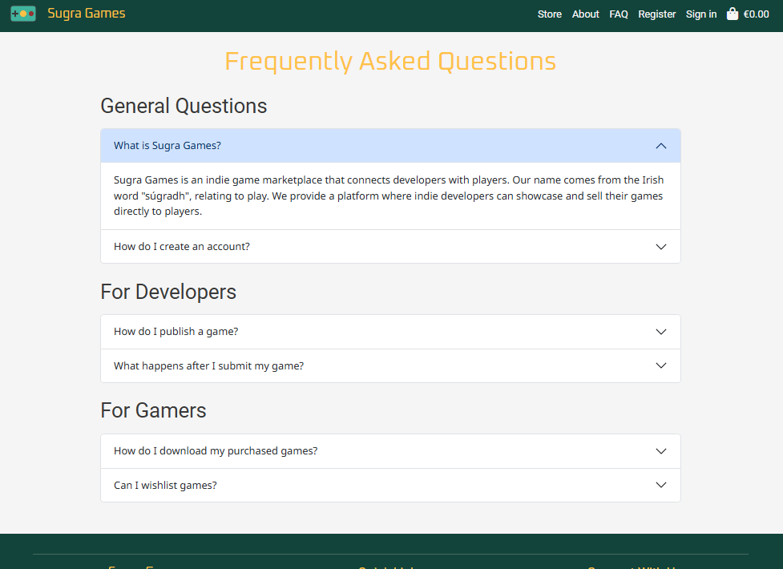

The FAQ page provides answers to common questions that users may have about the website. It is a good way to provide information to the user without cluttering the main pages of the website, and is good for SEO 

#### Authentication

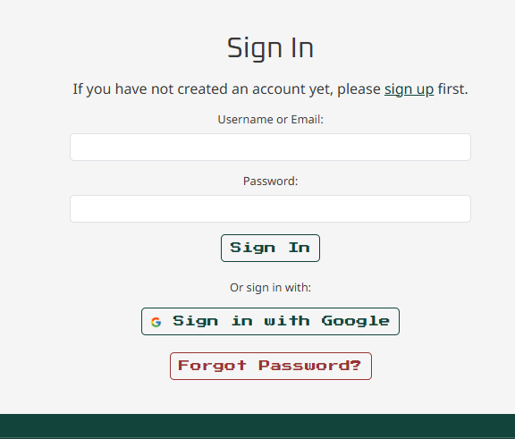

The authentication system allows users to log in and out, as well as register for an account. It also allows for social authentication via Gmail. Users can also reset their passwords if required. 

#### Developer Dashboard

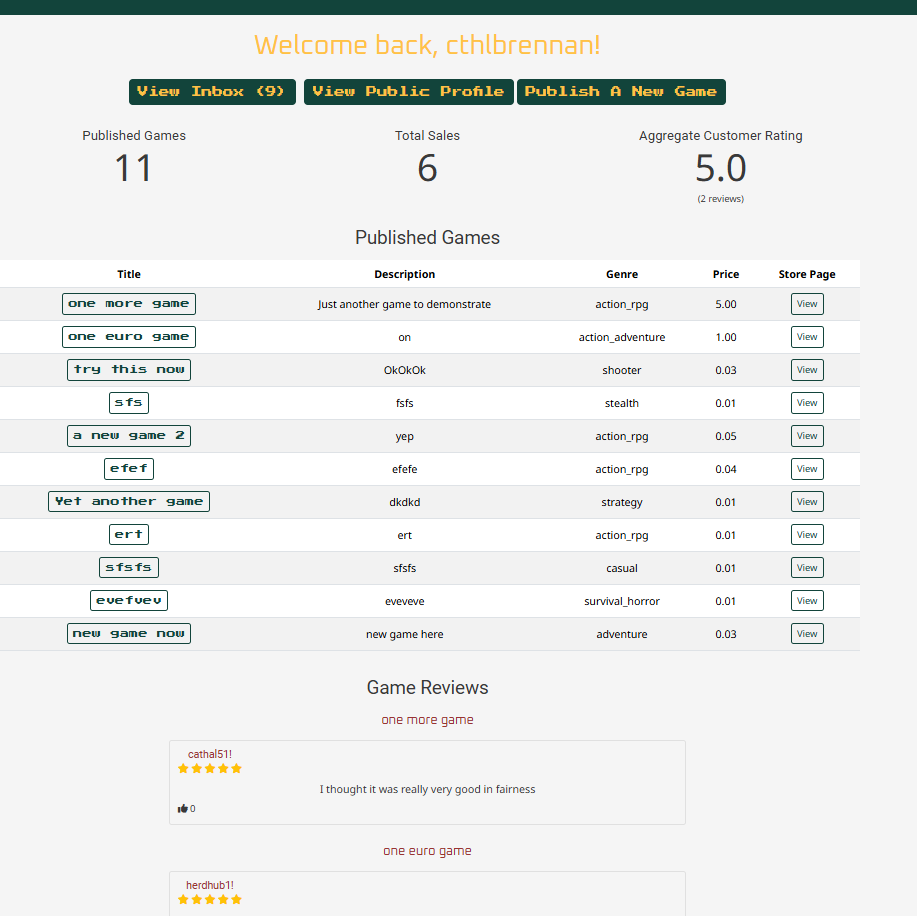

The developer dashboard allows developers to add games to the website, as well as edit and delete them. Developers can also view sales statistics and reviews for their games. 

#### Gamer Dashboard

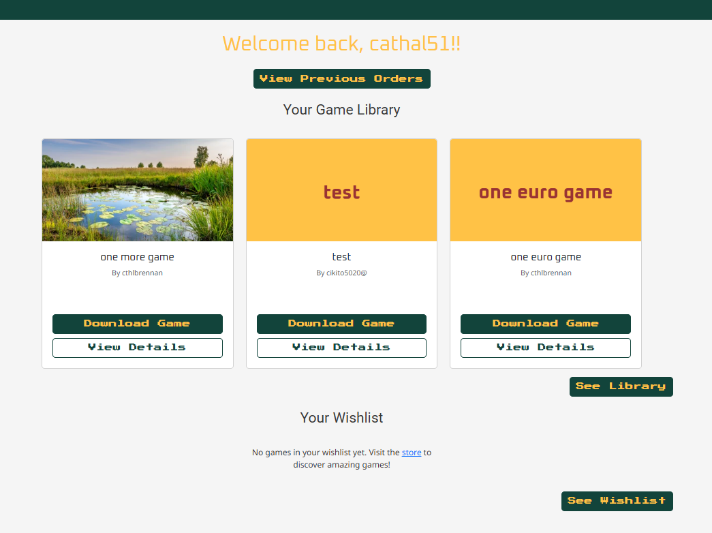

The gamer dashboard allows customers to view their wishlist, purchase history, and library. 

#### Game Submission

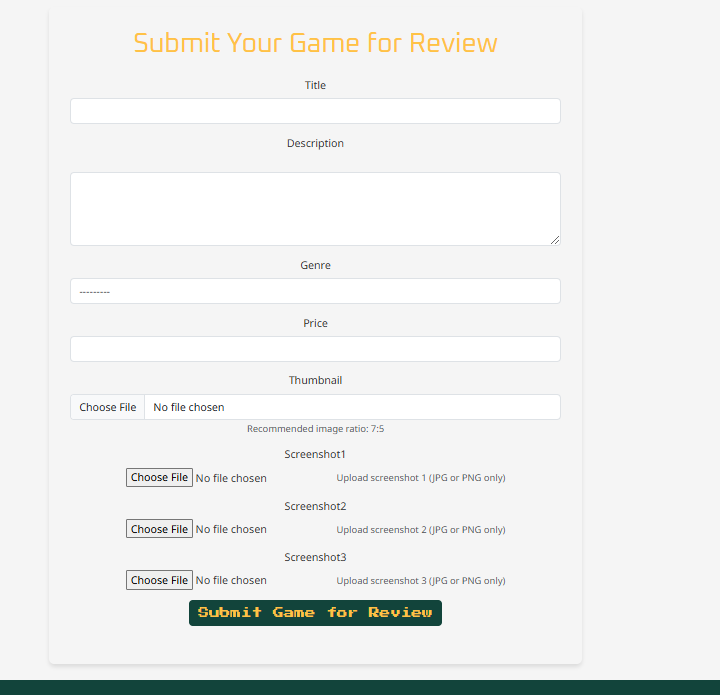

The game submission page allows developers to add games to the website. Games are assessed by the site administrator before being published, as will be discussed further below.

#### Profile Page

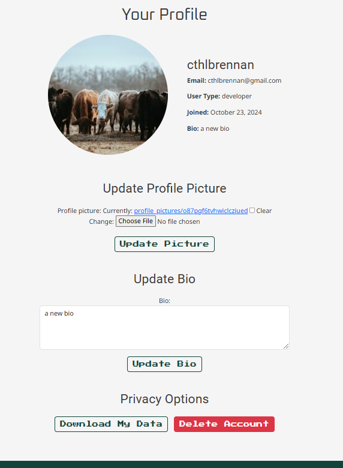

The profile page allows users to update their details and profile picture.  Users can also download a PDF of their personal data. 

#### Game Page

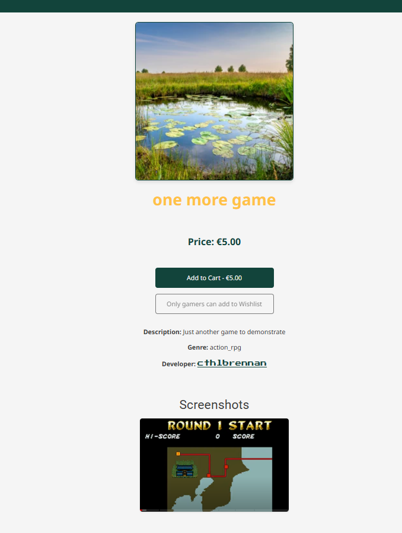

The game page provides more information about a game to the user. It features a large image of the game, as well as a description, price, and a button to purchase the game. There is also an Add to Wishlist button, screenshots, and the ability to leave a review, which other users can upvote or downvote. 

#### Developer Profile

The developer profile page features a grid of the developer's games, as well as a profile picture and bio. 

#### Admin Game Review

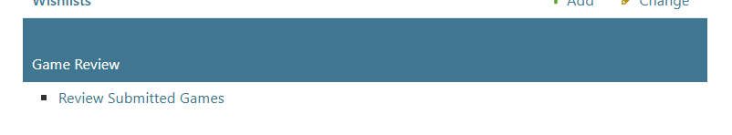

The admin game review page allows the site administrator to review new game submissions. Approved games are published on the storefront; others are rejected, with developers receiving feedback in their inboxes 

#### Shopping Features
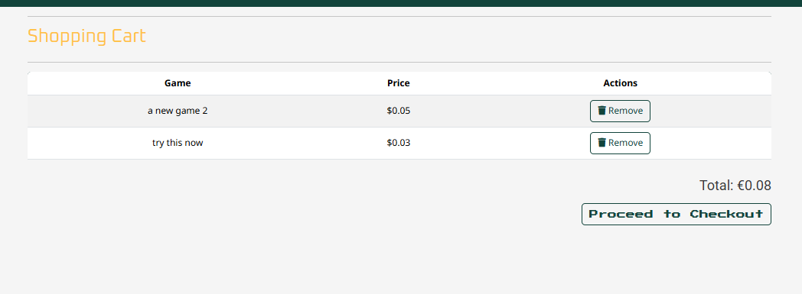
- **Cart System**:
  - Session-based shopping cart
  - Multiple game purchases
  - Price calculations
  - Cart persistence
- **Checkout Process**:
  - Secure payment integration
  - Order confirmation emails
  - Digital delivery system
  - Purchase history tracking
- **Game Discovery**:
  - Advanced search functionality
  - Genre filtering
  - Price range filters
  - "You might also like" recommendations
  - New releases section

#### Responsive Design
- **Mobile-First Approach**:
  - Responsive navigation
  - Touch-friendly interfaces
  - Optimized images
  - Fluid layouts
- **Cross-Browser Compatibility**:
  - Tested across major browsers
  - Consistent experience
  - Progressive enhancement
  - Fallback support

#### 404.html

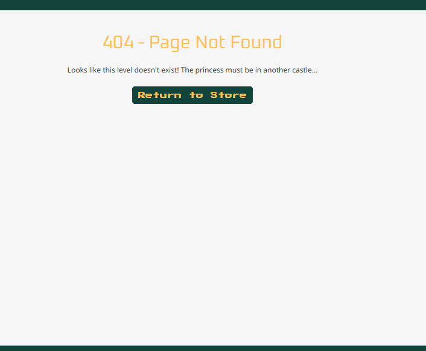

The website has a custom 404.html page which appears if the user tries to access a URL which doesn't exist. 

#### 500.html

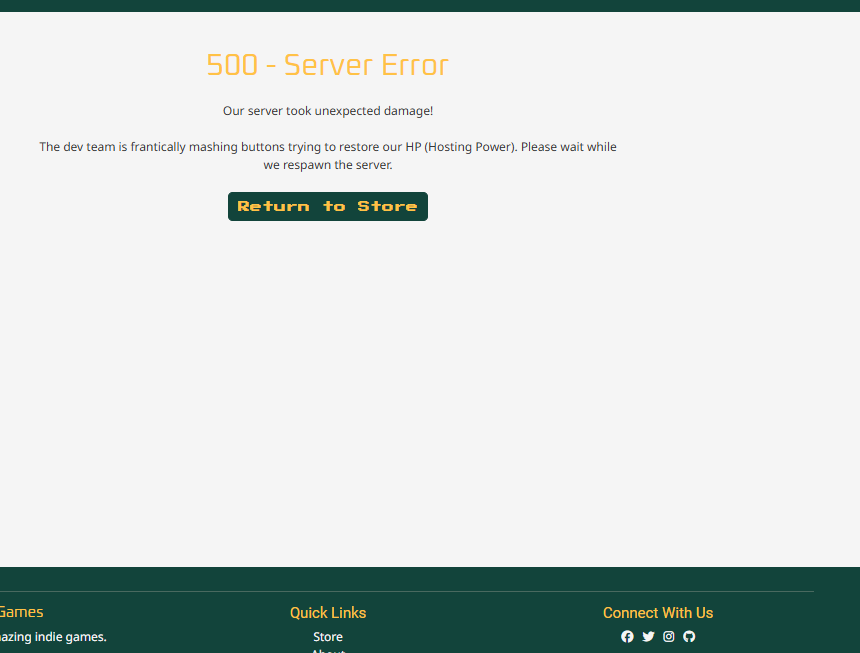

There is also a custom 500.html page which appears if a user encounters a server-side error. 

#### Contact Form

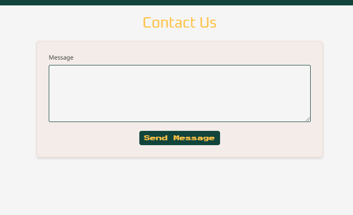

Accessible for signed in users, this page allows users to send messages to the site administrator in case of technical difficulty, feedback, etc. 

### Future Features
- **Community Features**:
  - User forums
  - Developer blogs
  - Achievement system
  - Friend lists
- **Enhanced Developer Tools**:
  - Analytics dashboard
  - A/B testing tools
  - Marketing integration
  - Revenue projections
- **Advanced Gaming Features**:
  - Cloud saves
  - Mod support
  - Beta testing platform
  - Early access program 

## Tools & Technologies Used

-  used to generate README and TESTING templates.
-  used for version control. (`git add`, `git commit`, `git push`)
-  used for secure online code storage.
-  used as a cloud-based IDE for development.
-  used for the main site content.
-  used for the main site design and layout.
-  used for user interaction on the site.
-  used as the back-end programming language.
-  used for hosting the deployed back-end site.
-  used as the front-end CSS framework for modern responsiveness and pre-built components.
-  used as the Python framework for the site.
-  was used as the PostgreSQL database management system.
-  used for online static file storage.
-  used for serving static files with Heroku.
-  used for creating wireframes.
-  used for the icons.
-  used to help debug, troubleshoot, and explain things.
- [Draw.io](https://www.draw.io) and [mermaid.live](https://www.mermaid.live) were used to create entity relationship diagrams.
- [GIMP](https://www.gimp.org) was used to make the logo and the default profile photo image
- [TinyURL.com](https://www.tinyurl.com) used throughout the project for shortening URL links
- Chrome DevTools was useful for testing the website for responsiveness during development and testing. 

## Database Design

At the outset of the project, I made an Entity Relationship Diagram (ERD) to help visualize the database architecture before creating my models.

While I did ultimately simplify certain aspects of the models, this ERD provided a good foundation before coding the actual models in my project.

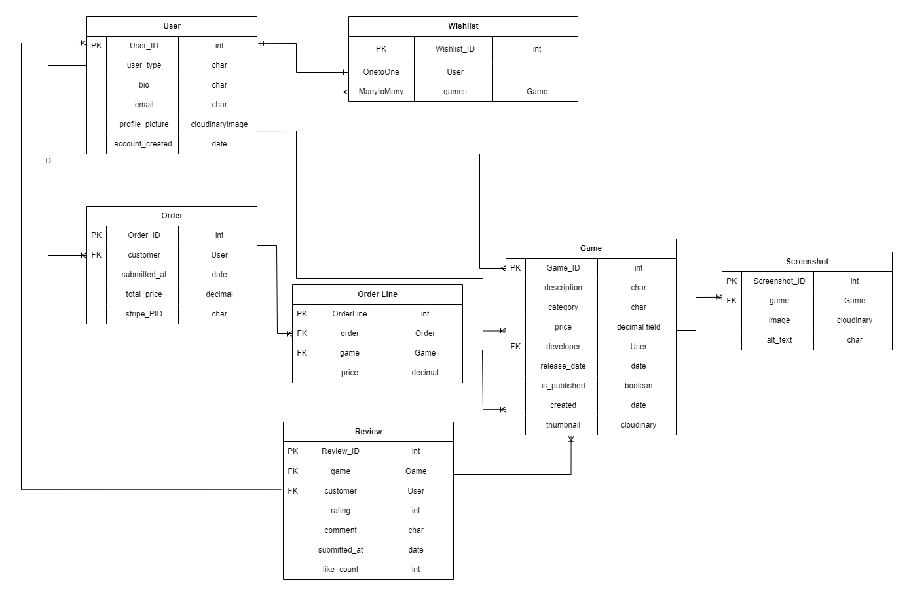

The ERD as included below reflects the finalised database architecture of the website. 

```mermaid
erDiagram
    User ||--o{ Game : develops
    User ||--o{ Order : places
    User ||--o{ Review : writes
    User ||--o{ Message : sends
    User ||--o{ ReviewVote : makes
    User ||--o{ InboxMessage : receives
    User ||--|| Wishlist : has

    Game ||--o{ Screenshot : has
    Game ||--o{ Review : receives
    Game ||--o{ OrderLine : contains

    Order ||--|{ OrderLine : includes

    Review ||--o{ ReviewVote : has

    User {
        int user_id PK
        string username UK
        string user_type
        string email
        text bio
        string profile_picture
        datetime account_created
    }

    Game {
        int game_id PK
        string title UK
        text description
        string genre
        decimal price
        int developer_id FK
        boolean is_published
        string thumbnail
        datetime created_at
    }

    Order {
        int order_id PK
        int customer_id FK
        datetime submitted_at
        decimal total_price
        string stripe_pid
    }

    OrderLine {
        int orderline_id PK
        int order_id FK
        int game_id FK
        decimal price
    }

    Review {
        int review_id PK
        int game_id FK
        int customer_id FK
        int rating
        text comment
        datetime submitted_at
        int like_count
    }

    Screenshot {
        int screenshot_id PK
        int game_id FK
        string image
        string alt_text
    }

    Message {
        int message_id PK
        int user_id FK
        text content
        datetime timestamp
        boolean read
    }

    InboxMessage {
        int message_id PK
        int developer_id FK
        string game_title
        text content
        datetime created_at
        boolean is_read
        string status
    }

    ReviewVote {
        int review_id FK
        int user_id FK
        string vote_type
        datetime created_at
    }

    Wishlist {
        int wishlist_id PK
        int user_id FK
    }

  ```
Source: [Mermaid](https://mermaid.live/edit#pako:eNqNVttu2zAM_RXDz-0P5HnIMGTDhhXdXgIYiszYRHUxJCppkeTfJ8mOY8vKmjzEMcmQ5xyRtE8l1zWUqxLMF2SNYXKrCv95tWCK8_n5WZ-Kr0xCsSpqOIDQnV0G_DS1v1kVnWAcMv7fcEA4-oCjQcoF_ABrWROKWFD13Qx_NIUYyd5ySb6pnX6_ZTLAAQ-LwPO5-Iu2FWjJB7XM-_uIyHJI9cINgLKtHmPSiJHSvMw0JKryHVUAw7Uihmos1isW8cwDUXHhahgDhzo5GSbYI7tT_zt8UFHhvK3Cuvi1udktGVRNdKmA9DXvq-ijg4UHJENxsxK8U7FDvYjrjN6jgKpDTs5M8tSMgNCXZZxrp6jyKntT3UdcZgeRkGm87Q4ZQhJzJhGZ15Ab7Ai1WvylATXDBRwlEx44cpjXHXq-V3I9qbHTWgBTBdqqczvfTe2VxxRa6-ROzVQbNRi4V4wS-n1rJPx1MKYCBAd3lrRc4hvrWLeTSNNKU8qkiYkqIT6gD5cuHGOdQxj7NYdSeEcO6Uhhvcmf7Qz-8kguyUgktU205grn8v9PupiNkZcgaSmupQRFD4scEgl8gyp2e8JismISJnb0PMpmODCvWLM8RiaoCvCT-tdFmRSXvTlX-bpQ1puFLoryuoQvS0x2y8Hx7Z_21WyBP47r7oxepz0oFrfEw7jT4Uwm_oZ9Ni6MnM32alzYd_t1_YDOQ42DT5Qs588Xyvi4SxAcB_sjZ33pL-VT6QfGPwdq_8YQ021LakHCtlz5nzXsmRO0Lbfq4kOZI_3yoXi5IuPgqTTaNW252jNh_Z3rAvThpaMPufwDXGCryg)

## Agile Development Process

Throughout the project, I prioritised the development and implementation of Agile methodologies as a means to efficiently prioritise and manage my workload. 

Initially, I commited to a central Theme for the website. From that, I derived Epics, each handling a particular area. I further broke down each Epic into several User Stories. 

![Theme, Epics and User Stories](documentation/agile/agile-methodology.drawio.png)

With the broad overview of the project broken down, I then used [GitHub Issues](https://github.com/cthlbrennan/sugra/issues) as an Agile methodology tool. There, I used my own **User Story Template** to manage User Stories, giving each of them Acceptance Criteria and User Tasks, as per best practice. 

[GitHub Projects](https://github.com/cthlbrennan/sugra/projects) also served as an Agile tool; While it isn't a specialized tool, I was able to easily adapt it to be used as the basis for weekly iteration boards, as well as a tool for documenting the Product Backlog. Through Github Projects, user stories, issues, and milestone tasks were planned, then tracked on a weekly basis.

![Iteration Board One](documentation/agile/iteration-board-one.png)

![Iteration Board Two](documentation/agile/iteration-board-two.png)

![Iteration Board Three](documentation/agile/iteration-board-three.png)

![Iteration Board Four](documentation/agile/iteration-board-four.png)

![Iteration Board Five](documentation/agile/iteration-board-five.png)

![Product Backlog](documentation/agile/product-backlog.png)

At the conclusion of the project, each User Story has been closed. 

[Open Issues](https://github.com/cthlbrennan/sugra/milestone/1) [![GitHub issues](https://img.shields.io/github/issues/cthlbrennan/sugra)](https://github.com/cthlbrennan/sugra/issues)


[Closed Issues](https://github.com/cthlbrennan/sugra/milestone/1?closed=1) [![GitHub closed issues](https://img.shields.io/github/issues-closed/cthlbrennan/sugra)](https://github.com/cthlbrennan/sugra/issues?q=is%3Aissue+is%3Aclosed)


### MoSCoW Prioritization

I've decomposed my Epics into stories prior to prioritizing and implementing them.
Using this approach, I was able to apply the MoSCow prioritization and labels to my user stories within the Issues tab.

- **Must Have**: guaranteed to be delivered (*max 60% of stories for every iteration*)
- **Should Have**: adds significant value, but not vital (*the rest ~20% of stories*)
- **Could Have**: has small impact if left out (*20% of stories*)
- **Won't Have**: not a priority for this iteration

## Testing

> [!NOTE]  
> For all testing, please refer to the [TESTING.md](TESTING.md) file.

## Deployment

The live deployed application can be found deployed on [Heroku](https://sugra-d21ca322fc38.herokuapp.com/).

### PostgreSQL Database

This project uses a [Code Institute PostgreSQL Database](https://dbs.ci-dbs.net).

To obtain my own Postgres Database from Code Institute, I followed these steps:

- Signed-in to the CI LMS using my email address.
- An email was sent to me with my new Postgres Database.

> [!CAUTION]  
> - PostgreSQL databases by Code Institute are only available to CI Students.
> - You must acquire your own PostgreSQL database through some other method
> if you plan to clone/fork this repository.
> - Code Institute students are allowed a maximum of 8 databases.
> - Databases are subject to deletion after 18 months.

### Cloudinary API

This project uses the [Cloudinary API](https://cloudinary.com) to store media assets online, due to the fact that Heroku doesn't persist this type of data.

To obtain your own Cloudinary API key, create an account and log in.

- For *Primary interest*, you can choose *Programmable Media for image and video API*.
- Optional: *edit your assigned cloud name to something more memorable*.
- On your Cloudinary Dashboard, you can copy your **API Environment Variable**.
- Be sure to remove the `CLOUDINARY_URL=` as part of the API **value**; this is the **key**.

### Heroku Deployment

This project uses [Heroku](https://www.heroku.com), a platform as a service (PaaS) that enables developers to build, run, and operate applications entirely in the cloud.

Deployment steps are as follows, after account setup:

- Select **New** in the top-right corner of your Heroku Dashboard, and select **Create new app** from the dropdown menu.
- Your app name must be unique, and then choose a region closest to you (EU or USA), and finally, select **Create App**.
- From the new app **Settings**, click **Reveal Config Vars**, and set your environment variables.

> [!IMPORTANT]  
> This is a sample only; you would replace the values with your own if cloning/forking my repository.

| Key | Value |
| --- | --- |
| `CLOUDINARY_URL` | user's own value |
| `DATABASE_URL` | user's own value |
| `DISABLE_COLLECTSTATIC` | 1 (*this is temporary, and can be removed for the final deployment*) |
| `SECRET_KEY` | user's own value |

Heroku needs two additional files in order to deploy properly.

- requirements.txt
- Procfile

You can install this project's **requirements** (where applicable) using:

- `pip3 install -r requirements.txt`

If you have your own packages that have been installed, then the requirements file needs updated using:

- `pip3 freeze --local > requirements.txt`

The **Procfile** can be created with the following command:

- `echo web: gunicorn app_name.wsgi > Procfile`
- *replace **app_name** with the name of your primary Django app name; the folder where settings.py is located*

For Heroku deployment, follow these steps to connect your own GitHub repository to the newly created app:

Either:

- Select **Automatic Deployment** from the Heroku app.

Or:

- In the Terminal/CLI, connect to Heroku using this command: `heroku login -i`
- Set the remote for Heroku: `heroku git:remote -a app_name` (replace *app_name* with your app name)
- After performing the standard Git `add`, `commit`, and `push` to GitHub, you can now type:
	- `git push heroku main`

The project should now be connected and deployed to Heroku!

### Local Deployment

This project can be cloned or forked in order to make a local copy on your own system.

For either method, you will need to install any applicable packages found within the *requirements.txt* file.

- `pip3 install -r requirements.txt`.

You will need to create a new file called `env.py` at the root-level,
and include the same environment variables listed above from the Heroku deployment steps.

> [!IMPORTANT]  
> This is a sample only; you would replace the values with your own if cloning/forking my repository.

Sample `env.py` file:

```python
import os

os.environ.setdefault("CLOUDINARY_URL", "user's own value")
os.environ.setdefault("DATABASE_URL", "user's own value")
os.environ.setdefault("SECRET_KEY", "user's own value")

# local environment only (do not include these in production/deployment!)
os.environ.setdefault("DEBUG", "True")
```

Once the project is cloned or forked, in order to run it locally, you'll need to follow these steps:

- Start the Django app: `python3 manage.py runserver`
- Stop the app once it's loaded: `CTRL+C` or `⌘+C` (Mac)
- Make any necessary migrations: `python3 manage.py makemigrations`
- Migrate the data to the database: `python3 manage.py migrate`
- Create a superuser: `python3 manage.py createsuperuser`
- Load fixtures (if applicable): `python3 manage.py loaddata file-name.json` (repeat for each file)
- Everything should be ready now, so run the Django app again: `python3 manage.py runserver`

#### Cloning

You can clone the repository by following these steps:

1. Go to the [GitHub repository](https://github.com/cthlbrennan/sugra) 
2. Locate the Code button above the list of files and click it 
3. Select if you prefer to clone using HTTPS, SSH, or GitHub CLI and click the copy button to copy the URL to your clipboard
4. Open Git Bash or Terminal
5. Change the current working directory to the one where you want the cloned directory
6. In your IDE Terminal, type the following command to clone my repository:
	- `git clone https://github.com/cthlbrennan/sugra.git`
7. Press Enter to create your local clone.

Alternatively, if using Gitpod, you can click below to create your own workspace using this repository.

Please note that in order to directly open the project in Gitpod, you need to have the browser extension installed.
A tutorial on how to do that can be found [here](https://www.gitpod.io/docs/configure/user-settings/browser-extension).

#### Forking

By forking the GitHub Repository, we make a copy of the original repository on our GitHub account to view and/or make changes without affecting the original owner's repository.
You can fork this repository by using the following steps:

1. Log in to GitHub and locate the [GitHub Repository](https://github.com/cthlbrennan/sugra)
2. At the top of the Repository (not top of page) just above the "Settings" Button on the menu, locate the "Fork" Button.
3. Once clicked, you should now have a copy of the original repository in your own GitHub account!

### Local VS Deployment

To my knowledge, there are no differences between the local and deployed versions of the website. 

## Credits

### Content

| Source | Location | Notes |
| --- | --- | --- |
| [Code Institute](https://www.codeinstitute.net) | entire site | lessons on HTML, Javascript, CSS and Python in previous modules|
| [Django Project](https://docs.djangoproject.com/en/5.1/topics/forms/modelforms/) | forms | use of Meta class within Django forms |
| [Django Project](https://docs.djangoproject.com/en/5.1/ref/forms/widgets/) | forms | use of widgets within Django forms |
| [Django Project](https://forum.djangoproject.com/t/using-textchoices/26764) | forms | use of models.textChoices |
| [Django Project](https://docs.djangoproject.com/en/5.1/ref/validators/) | forms | use of validators |
| [Django Project](https://docs.djangoproject.com/en/5.1/topics/http/file-uploads/) | forms | use of request.FILES when instantiating forms |
| [Django Project](https://tinyurl.com/yey22m5r) | delete functionality | use of require_POST decorator |
| [Django Project](https://docs.djangoproject.com/en/5.1/ref/settings/#auth-password-validators) | entire site | authentication confirguration | 
| [Django Project](https://docs.djangoproject.com/en/5.1/topics/i18n/) | settings.py | internationalisation settings |
| [Django Project](https://docs.djangoproject.com/en/5.1/howto/static-files/) | settings.py | static file configuration |
| [Django Project](https://docs.djangoproject.com/en/5.1/ref/settings/#default-auto-field) | forms | primary key setting for forms |
| [Django Project](https://docs.djangoproject.com/en/5.1/howto/static-files/) | entire site | setting up static files within livestock_manager.urls |
| [Markdown Builder](https://tim.2bn.dev/markdown-builder) | README and TESTING | tool to help generate the Markdown files |
| [StackOverflow](https://tinyurl.com/2s493p8b) | entire project | CSS wildcard selector |
| [StackOverflow](https://tinyurl.com/y55a3pxt) | forms | overriding init method of forms.Model | 
| [StackOverflow](https://tinyurl.com/4jx3njdv) | 404 and 500 pages | custom 404/500.html pages in Django| 
| [StackOverflow](https://stackoverflow.com/questions/6259775/how-to-display-the-current-year-in-a-django-template) | entire site | display current year in DTL | 
| [StackOverflow](https://tinyurl.com/43rejs9f) | entire site | use of empty DTL tag| 
| [WhiteNoise](http://whitenoise.evans.io) | entire site | hosting static files on Heroku temporarily |
| [W3Schools](https://www.w3schools.com/css/css3_variables.asp) | entire site | how to use CSS :root variables |

### Media

| Source | Location | Type | Notes |
| --- | --- | --- | --- |
| Sugra logo | entire site | image | favicon on all pages, logo. Original image. |
| Default profile photo | entire site | image | Used as default profile photo when user does not upload their own. Original image. |
| Image by Frederic Christian, taken from [Unsplash](https://unsplash.com) | index.html | image | Used as hero image, hero-image-1.jpg |
| Image by Guillaume Coupy, taken from [Unsplash](https://unsplash.com) | index.html | image | Used as hero image, hero-image-2.jpg |
| Image by Kamil Switalski, taken from [Unsplash](https://unsplash.com) | index.html | image | Used as hero image, hero-image-3.jpg |
| Image by Stem List, taken from [Unsplash](https://unsplash.com) | index.html | image | Used as hero image, hero-image-4.jpg |

### Acknowledgements

Thanks to Tim Nelson and Marko Tot for their help and guidance. 
