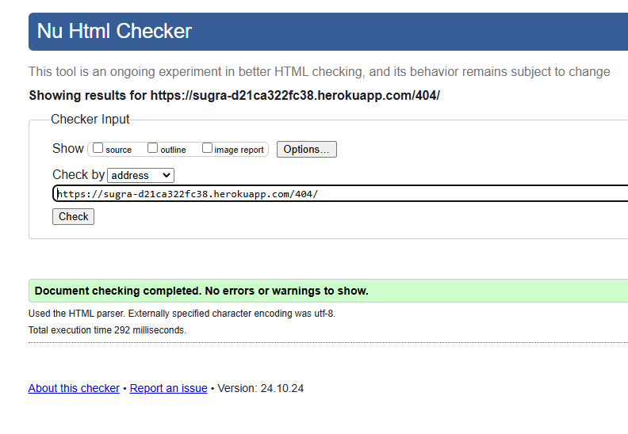
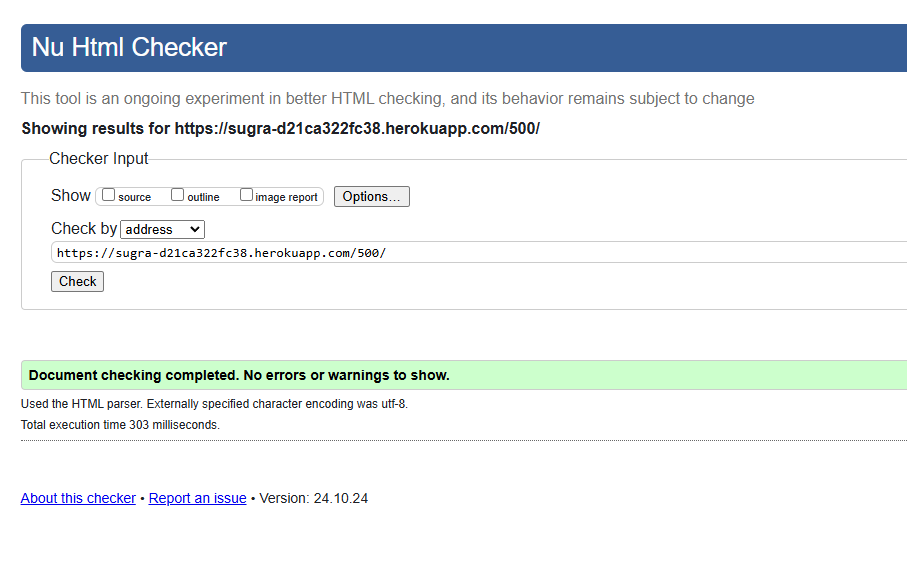
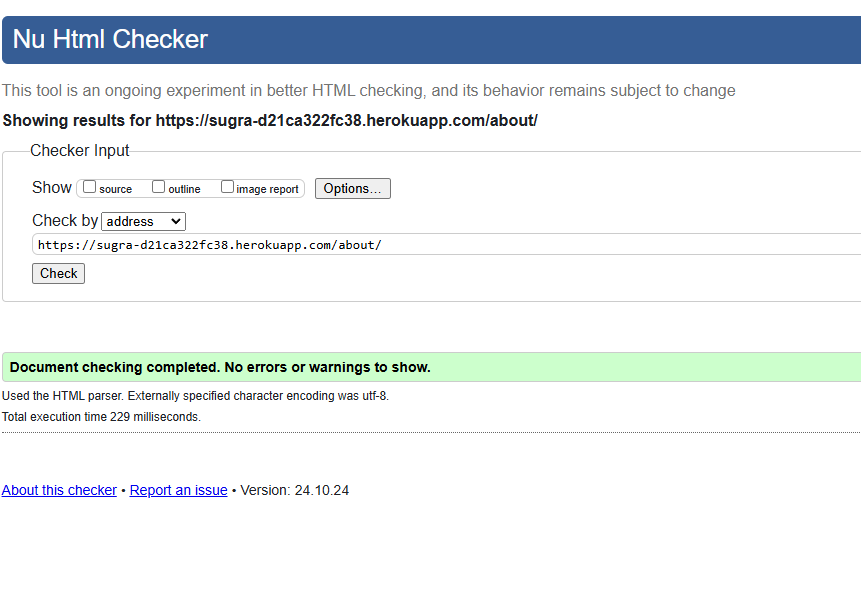
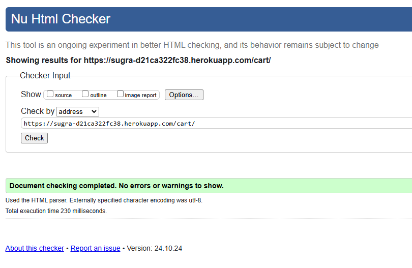
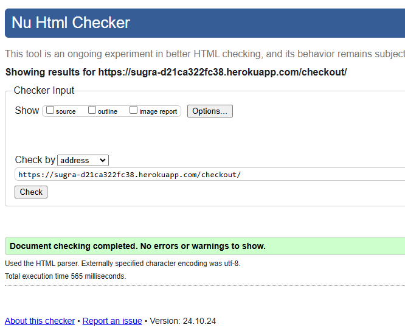
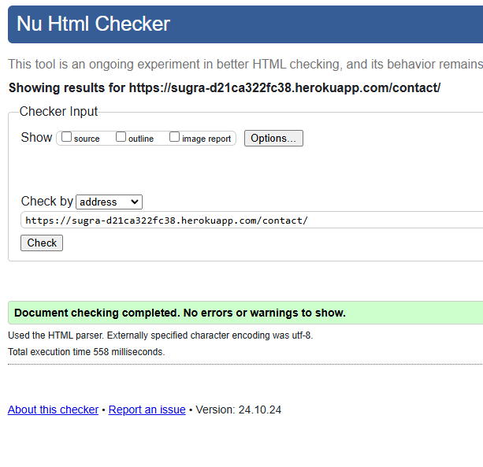
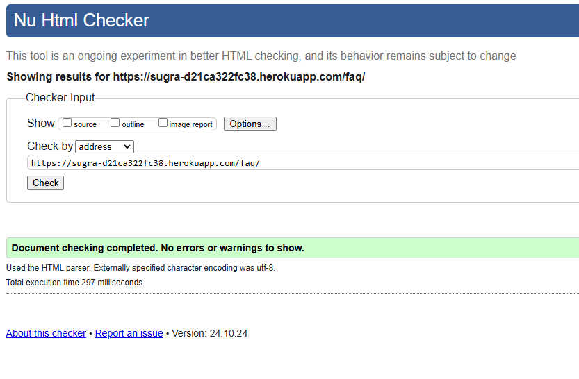
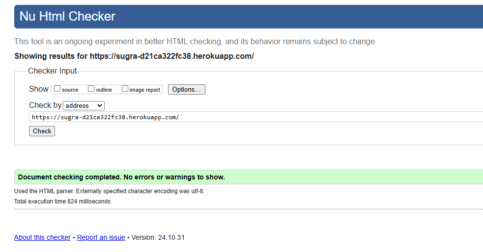
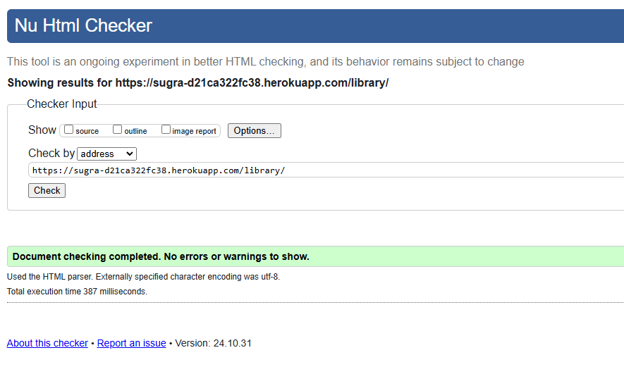
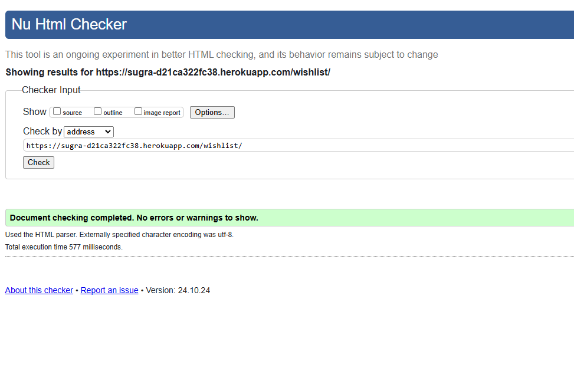

# Testing

> [!NOTE]  
> Return back to the [README.md](README.md) file.

## Code Validation

### HTML

| Directory | File | Screenshot | Notes |
| --- | --- | --- | --- |
| templates | 404.html |  | |
| templates | 500.html |  | |
| templates | about.html |  | |
| templates | base.html |  | |
| templates | cart.html |  | |
| templates | checkout_success.html |  | |
| templates | checkout.html |  | |
| templates | contact.html |  | |
| templates | developer_dashboard.html |  | |
| templates | developer_inbox.html |  | |
| templates | developer_profile.html |  | |
| templates | faq.html |  | |
| templates | game_detail.html |  | |
| templates | gamer_dashboard.html |  | |
| templates | index.html |  | |
| templates | library.html |  | |
| templates | order_history.html |  | |
| templates | privacy_policy.html |  | |
| templates | publish_game.html |  | |
| templates | set_user_type.html |  | |
| templates | user_profile.html |  | |
| templates | wishlist.html |  | |

### CSS

I have used the recommended [CSS Jigsaw Validator](https://jigsaw.w3.org/css-validator) to validate all of my CSS files.

| Directory | File | Screenshot | Notes |
| --- | --- | --- | --- |
| static | style.css |  | |

### JavaScript

I have used the recommended [JShint Validator](https://jshint.com) to validate all of my JS files.

| Directory | File | Screenshot | Notes |
| --- | --- | --- | --- |
| static | script.js |  | |
| static | script.text.js |  | JSHint identifies some undefined variables and a warning, but these relate to the keywords of Jest rather than syntactic faults in the Javascript code |

### Python

I have used the recommended [PEP8 CI Python Linter](https://pep8ci.herokuapp.com) to validate all of my Python files.

| Directory | File | CI URL | Screenshot | Notes |
| --- | --- | --- | --- | --- |
| herdhub | admin.py | [PEP8 CI](https://pep8ci.herokuapp.com/https://raw.githubusercontent.com/cthlbrennan/herdhub/main/herdhub/admin.py) |  | |
| herdhub | apps.py | [PEP8 CI](https://pep8ci.herokuapp.com/https://raw.githubusercontent.com/cthlbrennan/herdhub/main/herdhub/apps.py) |  | |
| herdhub | forms.py | [PEP8 CI](https://pep8ci.herokuapp.com/https://raw.githubusercontent.com/cthlbrennan/herdhub/main/herdhub/forms.py) |  | |
| herdhub | models.py | [PEP8 CI](https://pep8ci.herokuapp.com/https://raw.githubusercontent.com/cthlbrennan/herdhub/main/herdhub/models.py) |  | |
| herdhub | urls.py | [PEP8 CI](https://pep8ci.herokuapp.com/https://raw.githubusercontent.com/cthlbrennan/herdhub/main/herdhub/urls.py) |  | |
| herdhub | views.py | [PEP8 CI](https://pep8ci.herokuapp.com/https://raw.githubusercontent.com/cthlbrennan/herdhub/main/herdhub/views.py) |  | |
| livestock_manager | settings.py | [PEP8 CI](https://pep8ci.herokuapp.com/https://raw.githubusercontent.com/cthlbrennan/herdhub/main/livestock_manager/settings.py) |  | |
| livestock_manager | urls.py | [PEP8 CI](https://pep8ci.herokuapp.com/https://raw.githubusercontent.com/cthlbrennan/herdhub/main/livestock_manager/urls.py) |  | |
| root directory  | manage.py | [PEP8 CI](https://pep8ci.herokuapp.com/https://raw.githubusercontent.com/cthlbrennan/herdhub/main/manage.py) |  | |

## Browser Compatibility

I've tested my deployed project on multiple browsers to check for compatibility issues.

As can be seen below, every page of the website is both functional and fully compatible with Google Chrome, Microsoft Edge and Mozilla Firefox. 

- Google Chrome

- Microsoft Edge

- Mozilla Firefox

## Responsiveness

I've tested my deployed project with viewports of multiple width through DevTools.
- About Page

- Add Breeding Page

- Add Bull Page

- Add Calf Page

- Add Cow Page

- Contact Page

- Edit Breeding Page

- Edit Bull Page

- Edit Calf Page

- Edit Cow Page

- Home Page when logged out

- Home Page when logged in

- 404 Page

- 500 Page

- Sign In Page

- Sign Out Page

- Sign Up Page

- View Breeding Page

- View Bull Page

- View Calf Page

- View Cow Page

## Lighthouse Audit

| Page | Mobile | Desktop | Notes |
| --- | --- | --- | --- |
| Home when logged out |  |  | Minor warnings for performance on mobile and desktop |
| Home when logged in |  |  | Good performance on mobile and desktop |
| About |  |  | Minor warnings for performance on mobile and desktop |
| Contact Page |  |  | Good performance on mobile and desktop |
| 404 |  |  | Good performance on mobile and desktop |
| 500 |  |  | Good performance on mobile and desktop |
| Sign In |  |  | Good performance on mobile and desktop |
| Sign Out |  |  | Good performance on mobile and desktop |
| Sign Up |  |  | Good performance on mobile and desktop |
| Add Cow |  |  | Good performance on mobile and desktop |
| View Cow |  |  | Good performance on mobile and desktop |
| Edit Cow |  |  | Good performance on mobile and desktop |
| Add Bull |  |  | Good performance on mobile and desktop |
| View Bull |  |  | Good performance on mobile and desktop |
| Edit Bull |  |  | Good performance on mobile and desktop |
| Add Breeding |  |  | Good performance on mobile and desktop |
| View Breeding |  |  | Good performance on mobile and desktop |
| Edit Breeding |  |  | Good performance on mobile and desktop |
| Add Calf |  |  | Good performance on mobile and desktop |
| View Calf |  |  | Good performance on mobile and desktop |
| Edit Calf |  |  | Good performance on mobile and desktop |

## User Story Testing

### Users

| User Story | Screenshot/Comments | Completed? |
| --- | --- | --- |
| As a new user, I want to have a clear idea of the purpose of the web application so that I can understand the value that it would provide me. |  | Yes |
| As a user, I want to add photos to animal profiles so that I can include photos within my database.|  | Yes |
| As a user, I want to be able to log out easily so that I can be sure that my data remains secure after I have finished using the website. |  | Yes |
| As a user, I want to be able to change the details of a specific animal so that my database remains up-to-date. |  | Yes |
| As a user, I want to create profiles for each of my animals so that I can easily track their individual history and characteristics. |  | Yes |
| As a user, I want to view a list of all animals in my herd with key details shown, so that I can read an overview of my herd. |  | Yes |
| As a user, I want to be able to select a specific animal or breeding event and access comprehensive detailed overview of it. |  | Yes |
| As a user, I want to log breeding events so that I can monitor reproductive outcomes and optimise my breeding program. |  | Yes |
| As a user, I want to be able to delete animals from my database in case an animal is sold, dies, etc, so that I can maintain an accurate database. |  | Yes |
| As a user, I want to be able to register an account so that I can manage my livestock. |  | Yes |
| As a user, I want to be able to log in with a username and password so that I can securely access my data. |  | Yes |
| As a logged in user, I want to navigate my records easily so that I can easily access my data. |  | Yes |
| As a user, I want to be able to log in through my gmail or social media account. | Not implemented due to time constraints | No |
| As a user, I want to be able to reset my password so that I can regain access to my database in case I forget the original. | Not implemented due to time constraints | No |

### Product Owner

| User Story | Screenshot/Comments | Completed? |
| --- | --- | --- |
| As the product owner, I want to make sure that the models are fully functional so that users don't experience bugs. |  | Yes |
| As the product owner, I want users to get messages after they've logged in, logged out, successfully added an animal, etc so that they get immediate feedback on their interactions. |  | Yes |
| As the product owner, I want there to be an admin account so that the website can be monitored and maintained. |  | Yes |
| As the product owner, I want to make sure that all code is validated so that the code is clean, readable and maintainable. | See Code Validation seciton above | Yes |
| As the product owner, I want to ensure that my deployed website is linked to a cloud-based database. | See Deployment Section in README.md | Yes |
| As the product owner, I want to have the website deployed so that people can find and use my product. | See Deployment Section in README.md | Yes |
| As the product owner, I want the website to have a robust database schema that would serve the needs of users | See Database Design Section in README.md | Yes |
| As the product owner, I want the authentication pages to match the appearance of the rest of the site so that the site will have a coherent, consistent and professional appearance.| Sign In, Sign Out, Sign Up pages extend from base.html to fulfil this User Story | Yes |
| As the product owner, if a user submits a message then I want them to receive a confirmation email telling them that their message has been submitted to improve the user experience. | Not implemented due to time constraints | No |

### Site Administrator 

| User Story | Screenshot/Comments | Completed? |
| --- | --- | --- |
| As the administrator, I want to be able to securely access the admin page so that I can maintain and update the website easily. |  | Yes |
| As the administrator, I want to have CRUD functionality over all users' databases so that I can monitor and maintain the website. | Functionality provided through Admin Page shown above | Yes |
| As the administrator, I want users to be able to submit messages to me so that I can troubleshoot any problems they might have. |  | Yes |

## Defensive Programming

Defensive programming was manually tested, with results set out below. Click on screenshots to zoom in. 

| Page | User Action | Expected Result | Result | Fix | Screenshot |
| --- | --- | --- | --- | --- | --- |
| Home | Clicking on navbar links and logo | The links will send me to their corresponding pages, page that I'm on will appear as 'active' (darker colour) in navbar, clicking logo will take me back to home page | The features behaved as expected | Test concluded and passed |  |
| Home | Click call-to-action buttons, footer links and social media links at bottom of screen | They will lead to the right pages, social media links will open relevant websites in new tabs | The features behaved as expected | Test concluded and passed |  |
| About | Click call-to-action buttons at bottom of home page | Links will lead to correct pages | The feature behaved as expected | Test concluded and passed |  |
| Sign up | Make a new account | New account will be created, will be redirected to dashboard, message will appear saying I successfully signed in | The features behaved as expected | Test concluded and passed |  |
| Sign in | Sign into new account | Enter credentials, will be redirected to dashboard, message will appear saying I successfully signed in | The features behaved as expected | Test concluded and passed |  |
| Sign out | Sign out of account | Sign out of account, will be redirected to home page, message will appear saying I successfully signed out | The features behaved as expected | Test concluded and passed |  |
| Admin | Go to admin url, enter credentials | Successfully sign into admin page | The feature behaved as expected | Test concluded and passed |  |
| Send Message | Send message from contact page | Get redirected to dashboard, message will appear saying I successfully sent a message. Go to admin page, see if message appears | The features behaved as expected | Test concluded and passed |  |
| Add Cow | Go to add cow page, enter a cow  | Get redirected to dashboard, message will appear saying I successfully added a cow to my database, details of cow will appear on dashboard, herd overview will be updated accordingly | The features behaved as expected | Test concluded and passed |  |
| Add Cow | Go to add cow page, enter adversarial values into fields to try and undermine functionality | Regex validator in Model will prevent registration number from having special characters, max length will be 10 characters. Users won't be able to put future dates into date pickers. Milk production and number of calvings fields can't be negative number | The features behaved as expected | Test concluded and passed |  |
| View and Edit Cow | Go to view cow page, then edit cow page, add an image | Get redirected back to view cow page, message will appear saying Cow Image added, details of cow will be updated accordingly | The features behaved as expected | Test concluded and passed |  |
| Edit Cow | Go to edit cow page, enter adversarial values into fields to try and undermine functionality | Regex validator in Model will prevent registration number from having special characters, max length will be 10 characters. Users won't be able to put future dates into date pickers. Milk production and number of calvings fields can't be negative number | The features behaved as expected | Test concluded and passed |  |
| Delete Cow | Click on delete cow button | Modal will appear asking for confirmation, confirm, then message will appear saying I've successfully deleted the cow | The feature behaved as expected | Test concluded and passed |  |
| Add Bull | Go to add bull page, enter a bull  | Get redirected to dashboard, message will appear saying I successfully added a bull to my database, details of bull will appear on dashboard, herd overview will be updated accordingly | The features behaved as expected | Test concluded and passed |  |
| Add Bull | Go to add bull page, enter adversarial values into fields to try and undermine functionality | Regex validator in Model will prevent registration number from having special characters, max length will be 10 characters. Users won't be able to put future dates into date pickers. | The features behaved as expected | Test concluded and passed |  |
| View and Edit Bull | Go to view bull page, then edit bull page, add an image | Get redirected back to view bull page, message will appear saying Bull Image added, details of bull will be updated accordingly | The features behaved as expected | Test concluded and passed |  |
| Edit Bull | Go to edit bull page, enter adversarial values into fields to try and undermine functionality | Regex validator in Model will prevent registration number from having special characters, max length will be 10 characters. Users won't be able to put future dates into date pickers. | The features behaved as expected | Test concluded and passed |  |
| Delete Bull | Click on delete bull button | Modal will appear asking for confirmation, confirm, then message will appear saying I've successfully deleted the bull | The feature behaved as expected | Test concluded and passed |  |
| Add Breeding | Go to add breeding page, enter details of a breeding event, try to adversarially enter future date in date picker | No possibility to add future date due to Javascript in script.js. Enter correct detail, get redirected to dashboard, message will appear saying I successfully added a breeding to my database, details of breeding will appear on dashboard, herd overview will be updated accordingly | The features behaved as expected | Test concluded and passed |  |
| View and Edit Breeding | Go to view breeding page, then edit breeding page, try to pick future date for Breeding Date | Unable to input future date in date picker due to Javascript, enter correct value, get redirected back to view breeding page, message will appear stating breeding details updated, details of breeding will be updated accordingly | The features behaved as expected | Test concluded and passed |  |
| Delete Breeding | Click on delete record button | Modal will appear asking for confirmation, confirm, then message will appear saying I've successfully deleted the breeding event | The feature behaved as expected | Test concluded and passed |  |
| Add Calf | Go to add calf page, enter calf details, try adversarially to enter incorrect details for registration number and future date for date of birth | Regex validation prevents improper input for registration number, Javascript code prevents future date from being inputted through date picker. Enter correct values, get redirected to dashboard, message will appear saying I successfully added a calf to my database, details of calf will appear on dashboard, herd overview will be updated accordingly | The features behaved as expected | Test concluded and passed |  |
| View and Edit Calf | Go to view breeding page, then edit breeding page, try to pick future date for Breeding Date and input incorrect value for registration number. Add image | Unable to input future date in date picker due to Javascript or incorrect value for registration number due to Javascript. Enter correct values, get redirected back to view calf page, message will appear stating image of calf added, details of calf will be updated accordingly | The features behaved as expected | Test concluded and passed |  |
| Delete Calf | Click on delete calf button | Modal will appear asking for confirmation, confirm, then message will appear saying I've successfully deleted the calf | The feature behaved as expected | Test concluded and passed |  |

## Automated Testing

For my project, I have used the [Jest](https://jestjs.io) JavaScript testing framework.

In order to work with Jest, I first had to initialize NPM.

- `npm init`
- Hit `enter` for all options, except for **test command:**, just type `jest`.

Add Jest to a list called **Dev Dependencies** in a dev environment:

- `npm install --save-dev jest`

**IMPORTANT**: Initial configurations

When creating the test files, the name of the file needs to be `file-name.test.js` in order for Jest to properly work. In my case, as I was testing a file in the static directory called script.js, I had to name the file 'script.test.js'. This is located in the tests folder, within the js folder in the static directory.

Without the following, Jest won't properly run the tests:

- `npm install -D jest-environment-jsdom`

All four Jest tests passed successfully. However, the third test did not work as expected, as the test could not identify the correct label element on the add_cow.html page despite much bug testing. Regardless, using the website it is clear that the Javascript in question does work, as it shifts the textarea associated with the comments label to the subsequent line, if a form with a comments label appears on the page. As such, this is deemed acceptable.

- Jest Testing

## Bugs

### 1 - Error after renaming project file 

When I first created the project, I called the project 'Herdhub'. However, I then wanted the app to be called 'Herdhub', so I renamed the project to 'livestock_manager'.

However, this created many issues. When you create a project, many default values in settings.py, manage.py, and other files are declared using the name of the project. When the name of the project is changed, these values must also be changed in order for the entire project to function.

I first noticed this after I created the project and app file directories. I ran the 'python manage.py runserver' command in the terminal. However, it didn't work. I got an error message back telling me that the the module 'herdhub.settings' couldn't be found.

However, my project file directory, called 'livestock-project', had the settings.py file. The app, called 'herdhub', would not have had the settings.py file. 

This mislabelling meant that I had to go through the livestock-project file directory and change any lines written as 'herdhub.settings' to 'livestock-project.settings'. Amendments were made in the settings.py and wsgi.py files of the project
file, and the main function  definition in manage.py. 

Once these amendments were made, the server worked and I received a HttpResponse through the index route as expected.

### 2 - Two requirements.txt files  

When deploying, I was getting an error and couldn't see the website.

After much troubleshooting and looking at the Heroku logs, I realised I had misspelled 'pip freeze --local > requirements.txt', writing 'requirments.txt' instead after installing gunicorn. Gunicorn was recorded as a dependency in the wrong file. 

Once this was fixed, the deployed website worked fine. 

### 3 - DTL extends tag for view_cow.html  

From the dashboard, I was trying to view the details of cows I had added. 

However, this would result in a 500 error. After debugging, I realised that for the view_cow.html template, I had forgotten to add the quotation marks around base.html in the Django Template Language code at the top of the page.

Once this was fixed, view_cow.html was operational. 

### 4 - URL for add_bull.html in Dashboard 

From the dashboard, I was trying to access the add_bull.html page.

However, this would result in a 404 error. 

The correct path was set out in herhub.urls, so that wasn't the problem. 

Looking finally at index.html, I saw that the anchor element linked to 'add_bull.html'. This is incorrect, as '.html' should not be included as part of the href attribute. 

Once this was corrected, add_bull.html was accessible. 

### 5 - Accessing send_message.html 

I was trying to access the send_message.html page using the link in the navbar while logged in.

However, this would result in a 405 error. 

Looking at views.py, I realised I had mistakenly applied the require_POST decorator to the send_message view. 

Once this was removed, the Contact link to the send_message.html page worked properly.  

### 6 - Internal Dashboard links 

I was setting up the internal links from the top of the Dashboard to the subsections underneath.

I had a 404 error when clicking the 'Calves' link.

After some troubleshooting, I realised that I had not included the # with the href attribute in the html. 

Once this was resolved, the internal link worked as intended. 

### 7 - Designing Dashboard 

In designing the Dashboard, the subsections for cows and bulls had the proper appearance. 

However, the breedings and calves subsections were much wider in the page.

After going through index.html, I realised that this inconsistency was caused by spare div tags within the html code. 

Once the extra divs were removed, all four subsections were then included within the Dashboard container class and then had the correct appearance. 

### 8 - Responsiveness for comments textarea field  

Below 500 pixels, I found that the comments field on the add and edit pages did not reduce in size proportionally along with the rest of the form elements. This caused poor responsiveness.  

The rows and columns of the textarea were fixed in the html code, irrespective of responsiveness concerns. 

To manage this, I introduced Javascript code that would target this element if the viewport was lower than 500 pixels in width. The column and row attributes of the textarea element would change dynamically. 

This had the desired effect and resolved the responsiveness issue. 

## Unfixed Bugs

As noted, I could not get the third Jest test to work, despite much troubleshooting. This is not particularly important as it can be seen on the website that the Javascript relating to comments labels does work, but the flaw with the third Jest test is still notable. 

There are no remaining bugs that I am aware of.